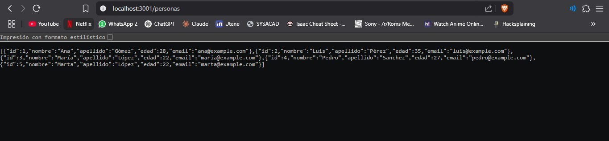
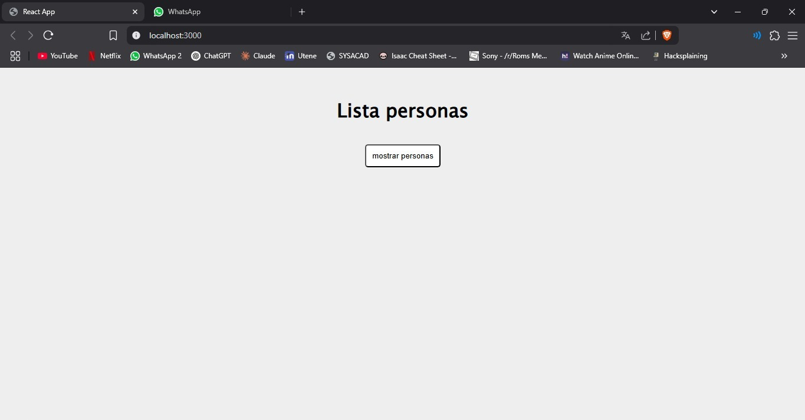
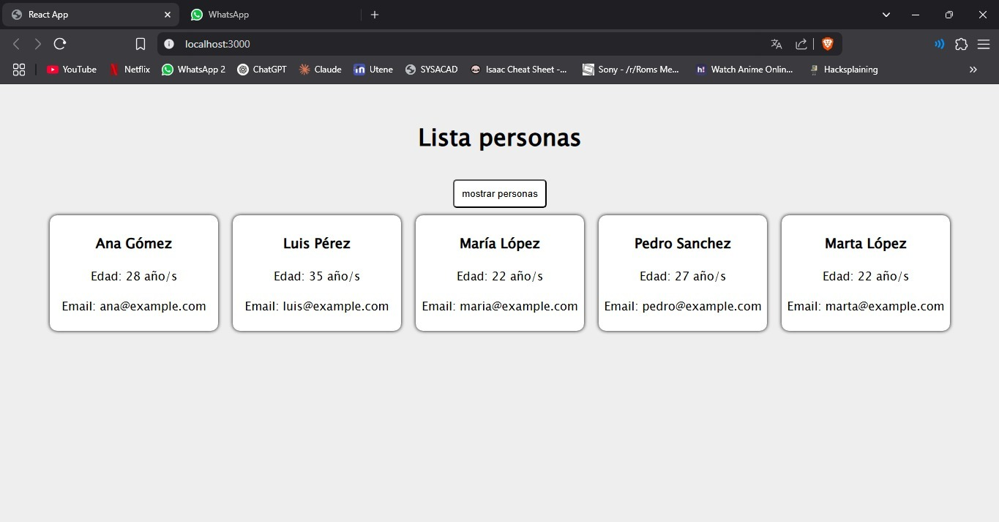

## Trabajo practico 4
### grupo 24
#### Hicimos correr el backend con Node server.js:

#### Corrimos el frontend con npm start:

#### La base de datos se puede ver por medio del frontend:

- Jeronimo Baltian Ortiz
- Gianfranco Campagnucci
- Carlos Arce
- Dario Colantonio